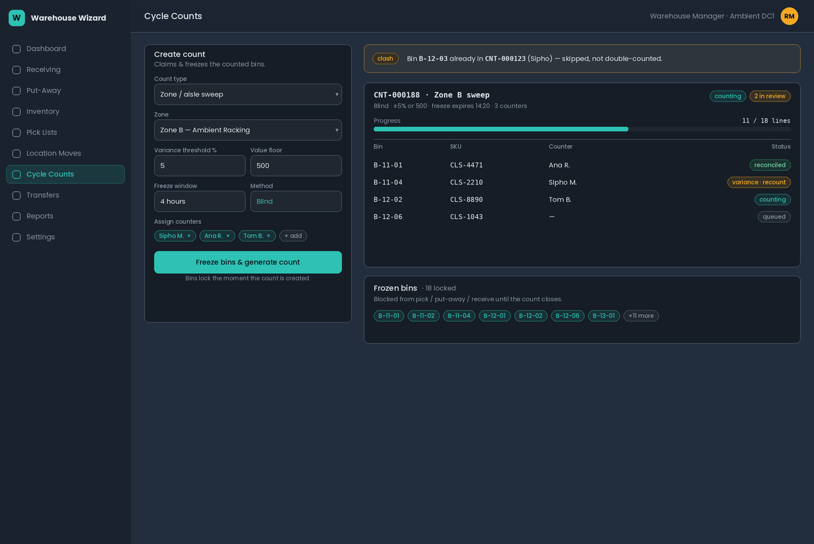
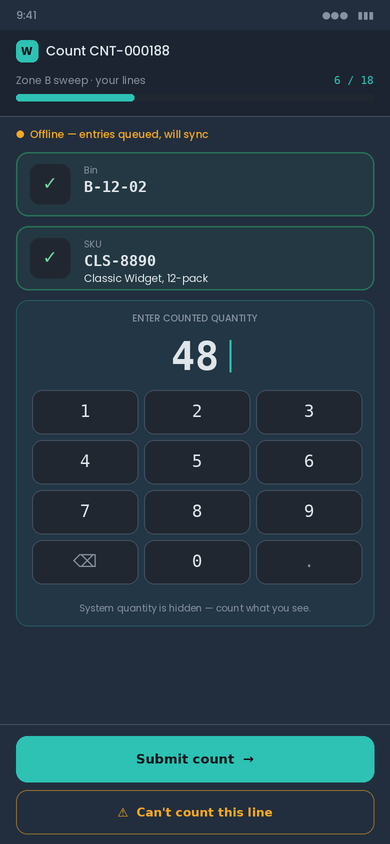
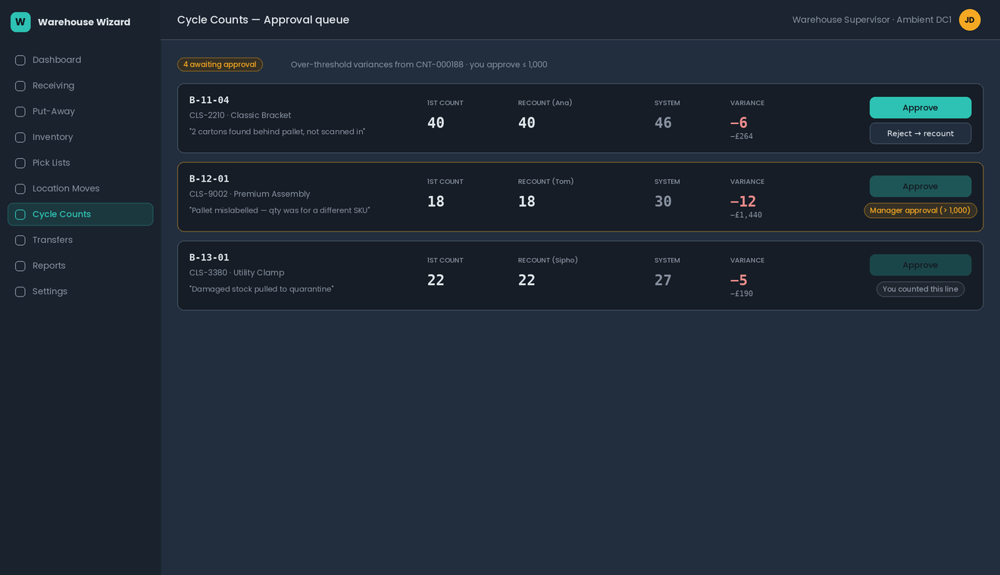
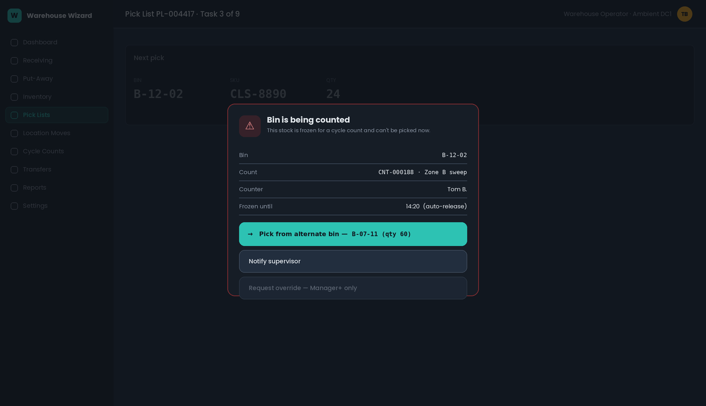

# Cycle Counts — Architecture & Design Spec

**Status:** Pre-code design (approved decisions locked). Do not begin implementation until this doc is signed off.
**Module:** `src/features/cycle-counts/` (segmented by page, per project convention)
**Author:** Design pass, 2026-07-08
**Related code today:** `cycle-counts-core.ts`, `cycle-counts-page.tsx`, `supabase/migrations/20260511000000_consolidated_wms_schema.sql`

---

## 1. Purpose & scope

Deliver a cycle-count / periodic inventory-check module that is **safe to run in a live, multi-user warehouse**. It must let stock be counted while the warehouse keeps operating, freeze the specific stock being counted so it can't be picked/received/moved mid-count, resolve clashes when several people count at once, and enforce who is allowed to do what.

### Locked decisions (from requirements review)

| # | Decision | Choice |
|---|----------|--------|
| 1 | Freeze policy | **Hard freeze on counted bins only.** Rest of warehouse runs normally. |
| 2 | Count method | **Blind** (counter never sees expected). Over-threshold variance **auto-triggers a recount** before any adjustment. |
| 3 | Adjustments | Counter counts; **Supervisor+ approves** over-threshold variances. Never approve your own count. |
| 4 | Clash policy | **Exclusive claim per bin** — a bin can be in only one open count at a time. |
| 5 | Count types | Ad-hoc **spot/bin**, **zone/aisle sweep**, **ABC scheduled** cycle counts. (No full-warehouse physical-inventory freeze.) |
| 6 | Who initiates | **Supervisor and above.** Clerks + assigned operators execute. |
| 7 | Devices | **Mobile + desktop parity.** |
| 8 | Freeze safety | Freeze **auto-expires** after a configurable window and **alerts a supervisor**. |

---

## 2. What exists today, and the gaps

The current module is a working skeleton but is **not safe for live use**. Concrete issues in the code:

- **Instant, ungated adjustments.** `submitCycleCountLine()` writes straight to `pallets`, `inventory_balances`, and `stock_adjustments` on entry. `variance_threshold_percent` is displayed but never enforced; there is no approval step.
- **Informed counting, pre-filled with the answer.** The line input uses `defaultValue={counted}` where `counted = counted_quantity ?? expected_quantity`, so the operator sees and starts from the system quantity.
- **No freeze.** Nothing blocks pick/put-away/receive on a bin under count; the snapshot goes stale and produces phantom variances.
- **Single `assigned_user_id`** on `cycle_counts` — cannot model several people counting different areas, nor per-line assignment.
- **No exclusive claim.** `createCycleCountFlow` filters balances with no lock; two counts can include the same bin.
- **Separation-of-duties hole.** `warehouse_operator` sits in the Cycle Counts nav *and* the instant-adjust path.

The design below fixes each of these directly.

---

## 3. Data model

### 3.1 Enums

Extend `count_scope` and add a dedicated line-status enum (do **not** overload `task_status` for count lines — the count state machine is richer).

```sql
-- extend existing enum
alter type public.count_scope add value if not exists 'abc';   -- 'location' | 'zone' | 'sku' | 'spot' | 'abc'

-- new: count header lifecycle
create type public.count_status as enum (
  'draft', 'frozen', 'counting', 'review', 'approved', 'closed', 'cancelled'
);

-- new: per-line lifecycle
create type public.count_line_status as enum (
  'queued', 'counted', 'recount', 'variance_hold', 'approved', 'adjusted', 'reconciled', 'exception'
);

-- new: freeze lifecycle
create type public.freeze_status as enum ('active', 'released', 'expired', 'overridden');
```

### 3.2 `cycle_counts` (header) — changes

Add columns:

| Column | Type | Notes |
|--------|------|-------|
| `count_type` | `count_scope` | already have `scope`; rename usage to `count_type` in code, keep column, add `'abc'` |
| `status` | `count_status` | replace current `task_status` usage |
| `snapshot_at` | `timestamptz` | when expected quantities were frozen — the baseline moment |
| `freeze_expires_at` | `timestamptz` | auto-expiry deadline for all freezes in this count |
| `schedule_id` | `uuid null` | set when generated by an ABC schedule |
| `initiated_by` | `uuid` | Supervisor+ who created it (audit) |

Keep `variance_threshold_percent`. **Deprecate `assigned_user_id`** on the header — assignment moves to the line level (multi-user).

### 3.3 `cycle_count_lines` — changes

Replace the single `counted_quantity` model with a blind two-pass model:

| Column | Type | Notes |
|--------|------|-------|
| `assigned_user_id` | `uuid null` | per-line assignment (the multi-user unit of work) |
| `line_status` | `count_line_status` | new state machine |
| `first_count_qty` | `numeric` | blind first pass |
| `first_counted_by` | `uuid` | |
| `first_counted_at` | `timestamptz` | |
| `recount_qty` | `numeric null` | blind second pass (only if triggered) |
| `recounted_by` | `uuid null` | **must differ from `first_counted_by`** (enforced) |
| `recounted_at` | `timestamptz null` | |
| `variance_quantity` | `numeric` | computed at count time, server-side |
| `variance_percent` | `numeric` | |
| `approved_by` | `uuid null` | Supervisor+; **≠ counter** (enforced in RLS + code) |
| `approved_at` | `timestamptz null` | |
| `adjustment_id` | `uuid null` | FK to the `stock_adjustments` row once posted |
| `exception_reason` | `text null` | for `exception` lines |

`expected_quantity` stays but is **never sent to the counting UI**.

### 3.4 NEW `inventory_freezes` (the authoritative freeze set)

This is the single source of truth that operations check.

```sql
create table public.inventory_freezes (
  id             uuid primary key default gen_random_uuid(),
  cycle_count_id uuid not null references public.cycle_counts(id) on delete cascade,
  warehouse_id   uuid not null references public.warehouses(id),
  location_id    uuid references public.locations(id),   -- bin-level freeze
  pallet_id      uuid references public.pallets(id),      -- optional finer grain
  status         public.freeze_status not null default 'active',
  frozen_at      timestamptz not null default now(),
  expires_at     timestamptz not null,
  released_at    timestamptz,
  released_by    uuid,
  created_by     uuid not null,
  created_at     timestamptz not null default now()
);

-- EXCLUSIVE CLAIM: a location can be in only ONE active freeze at a time.
create unique index uniq_active_freeze_per_location
  on public.inventory_freezes (location_id)
  where status = 'active' and location_id is not null;
```

The partial unique index is what makes the "exclusive claim per bin" decision **enforced at the database level** — two counts cannot both claim the same bin; the second insert fails and that bin is reported as a clash.

### 3.5 NEW `cycle_count_schedules` (ABC / periodic backbone)

```sql
create table public.cycle_count_schedules (
  id             uuid primary key default gen_random_uuid(),
  warehouse_id   uuid not null references public.warehouses(id),
  name           text not null,
  velocity_class char(1) check (velocity_class in ('A','B','C')),
  zone_id        uuid references public.zones(id),         -- optional narrowing
  frequency_days integer not null,                          -- A=e.g.30, B=90, C=180
  variance_threshold_percent numeric not null default 5,
  next_run_at    timestamptz not null,
  active         boolean not null default true,
  created_by     uuid not null,
  created_at     timestamptz not null default now()
);
```

Add `velocity_class char(1)` (A/B/C, default 'C') **and `unit_cost numeric(14,2)`** to `products` — the latter powers the variance value floor and the manager escalation cap. A scheduled job (Supabase cron / edge function) reads due schedules, generates a `cycle_counts` header of type `abc`, and claims the relevant bins — same path as a manual count.

### 3.6 Audit

Reuse the existing system-log/user-activity mechanism (the code already has `writeSystemLog` / `listUserActivities`) for every state transition: freeze created/released/expired/overridden, count started, line counted, recount, approval, adjustment posted, override. No new table required unless you want a dedicated `cycle_count_events` view later.

---

## 4. Freeze mechanic & enforcement

### 4.1 Principle

A freeze is a **row in `inventory_freezes`**, not a flag smeared across inventory. Operations don't need to know *why* a bin is frozen — they ask one question: *"is there an `active` freeze covering this location (or pallet)?"* This keeps the mechanic in one place and makes auto-expiry trivial (flip status by time).

We also mirror the freeze onto working stock for fast reads and correct math: when a bin is frozen, move its `available_quantity` into `held_quantity` on the affected `inventory_balances`/`pallets` (both columns already exist). Picking already filters on `available_quantity > 0`, so **frozen stock instantly disappears from pick candidates with zero extra logic** in the allocator. On release, move it back.

### 4.2 Shared guard (single chokepoint)

Add one helper used by every stock-touching flow:

```ts
// src/features/cycle-counts/freeze-core.ts
export async function assertNotFrozen(locationId: string, opts?: { palletId?: string }):
  Promise<void>            // throws FrozenBinError with the count number + who to contact
export async function getActiveFreeze(locationId: string): Promise<Freeze | null>
```

Wire it in at these exact points (all found in current code):

| Flow | File / function | Hook |
|------|-----------------|------|
| Picking — candidate build | `picking-core.ts` → `createPickListFlow` (balance query ~L56) | exclude frozen locations from candidates |
| Picking — confirm | `picking-core.ts` (pick confirm, `nextAvailable` ~L291) | `assertNotFrozen` before decrementing |
| Put-away — confirm | `putaway-core.ts` → `confirmPutaway` (L35) | `assertNotFrozen(destinationLocationId)` |
| Receiving — put-to-bin | `receiving-core.ts` (balance writes ~L198+) | warn/block if target bin frozen |
| Location moves | `moves` core | block source & destination if frozen |

**Server-side is authoritative.** The client shows the warning early for UX, but the real block is an RPC/trigger that re-checks `inventory_freezes` inside the same transaction that would move stock — otherwise a race (or offline replay) could slip through. Given the app's offline queue, this matters: a queued pick that replays after a freeze must be rejected server-side and surfaced in the dead-letter queue.

### 4.3 Override & auto-expiry

- **Override:** Manager/Admin only. Overriding a freeze on an active count sets the freeze `overridden`, logs it loudly, and flags the affected count line as `exception` (its baseline is now untrustworthy).
- **Auto-expiry:** a scheduled job flips `active`→`expired` where `expires_at < now()`, restores held→available, and alerts the count's supervisor. `freeze_expires_at` is configurable per count (default e.g. 4h). Re-opening a count re-freezes with a fresh deadline.

---

## 5. Concurrency — the five-counter scenario

Your scenario: five people pull stock and start counts in different areas at once. Walkthrough of how the design resolves each clash:

1. **Two counts, different bins (the normal case).** Each count inserts freezes for its own bins. No index conflict. Both proceed in parallel. The rest of the warehouse keeps picking everywhere else.
2. **Two counts try to claim the same bin.** The partial unique index `uniq_active_freeze_per_location` rejects the second insert. The creating UI catches it and reports *"Bin A-12-03 is already in count CNT-000123 (Sipho) — skipped."* The clashing bin is dropped from the new count, not silently double-counted.
3. **A pick is in flight when a freeze lands.** The freeze moves `available`→`held`. An in-progress pick task that hasn't confirmed yet will fail `assertNotFrozen` at confirm and is bounced with *"This bin is being counted — pick an alternate or notify a supervisor."*
4. **A counter double-scans / two counters open the same line.** Line-level `assigned_user_id` plus optimistic-lock on `line_status` (only `queued`→`counted` by the assignee) means the second submit is rejected as stale.
5. **Recount by the same person.** Blocked: `recounted_by` must differ from `first_counted_by`. If only one counter is on shift, the recount routes to a Supervisor.
6. **Counter walks off mid-count.** Freeze auto-expires after the window, stock un-holds, supervisor is alerted, count reverts to `draft`/`review` for reassignment.

---

## 6. Blind count + recount state machine (per line)

```
queued ──assign──▶ (assigned) ──blind entry──▶ counted
counted ──| variance ≤ threshold |──▶ reconciled          (no adjustment needed)
counted ──| variance > threshold |──▶ recount
recount ──blind 2nd pass (different counter)──▶ variance_hold
variance_hold ──| recount confirms system qty |──▶ reconciled
variance_hold ──| recount confirms a real variance |──▶ (approval queue)
approval ──approve (Supervisor+, ≠ counter)──▶ approved ──post──▶ adjusted ──▶ reconciled
approval ──reject──▶ recount            (loop back, never auto-post)
any ──cannot count──▶ exception (reason required, supervisor review)
```

Key rules:
- The counting UI **never** receives `expected_quantity`.
- Variance is computed **server-side** at submit, so the client can't be tricked.
- Under-threshold variances reconcile automatically (optionally still logged). Over-threshold **cannot** post without an approval by someone who didn't count that line.
- A count header reaches `closed` only when **every** line is `reconciled`, `adjusted`, or a resolved `exception`. Closing releases all freezes and stamps `pallets.last_counted_at`.

---

## 7. Permissions & separation of duties

Mapped onto the existing seven roles (`developer, admin, warehouse_manager, warehouse_supervisor, inventory_clerk, warehouse_operator, dispatch_driver`).

| Capability | Dev | Admin | Mgr | Supervisor | Clerk | Operator | Driver |
|---|:--:|:--:|:--:|:--:|:--:|:--:|:--:|
| View cycle counts | ✔ | ✔ | ✔ | ✔ | ✔ | ✔ (assigned) | – |
| Initiate / schedule a count | ✔ | ✔ | ✔ | ✔ | – | – | – |
| Configure ABC schedules | ✔ | ✔ | ✔ | – | – | – | – |
| Execute (enter blind counts) | ✔ | ✔ | ✔ | ✔ | ✔ | ✔ (assigned lines only) | – |
| Approve over-threshold variance | ✔ | ✔ | ✔ | ✔ (≤ value cap) | – | – | – |
| Post adjustment | via approval | via approval | ✔ | ✔ (≤ cap) | – | – | – |
| Override / force-release a freeze | ✔ | ✔ | ✔ | – | – | – | – |

Hard rules, enforced in **both** app code and Supabase RLS (client checks are not trust boundaries):

- **`approved_by` must differ from `first_counted_by` and `recounted_by`.** You cannot approve a variance on stock you counted.
- **Operators can only touch lines where `assigned_user_id = auth.uid()`.**
- **Remove `warehouse_operator` from the instant-adjust path entirely** (current hole). Operators submit counts; they never move stock directly.
- Driver has no cycle-count access (drop from the Cycle Counts nav entry).

RLS sketch (illustrative):

```sql
-- operator can update only their own assigned, still-open line
create policy count_line_execute on public.cycle_count_lines
for update using (
  assigned_user_id = auth.uid()
  and line_status in ('queued','counted','recount')
);

-- approval requires supervisor+ AND not the counter
create policy count_line_approve on public.cycle_count_lines
for update using (
  public.has_min_role(auth.uid(), 'warehouse_supervisor')
  and auth.uid() <> coalesce(first_counted_by, '00000000-0000-0000-0000-000000000000')
  and auth.uid() <> coalesce(recounted_by,   '00000000-0000-0000-0000-000000000000')
);
```

---

## 8. UI layers (leads into the prototype)

Four surfaces, built with the app's existing shadcn/ui + react-hook-form + tanstack-query patterns:

1. **Manager / Supervisor — Create & Monitor** (desktop). Create a count (scope, threshold, freeze window, assignees); live board of active counts with per-line progress, clash notices, and the frozen-bin list.
2. **Counter — Blind Entry** (mobile-first, also desktop). Scan bin → scan SKU → key quantity. No expected shown. Big targets, offline-capable, "can't count" exception button. Shows only lines assigned to me.
3. **Supervisor — Approval Queue** (desktop + mobile). Over-threshold lines only: first count vs recount, variance, approve/reject with reason. Approve is disabled on lines you counted.
4. **Operations warning** — the frozen-bin banner/interstitial that appears inside Picking / Put-away / Receiving when a targeted bin is frozen, offering: pick alternate bin · notify supervisor · request override (Mgr+).

---

### Prototype screenshots

Non-functional mockups rendered in the app's own dark theme (teal primary / amber accent), stored alongside this spec in `/docs/`:

**1 — Manager: create & monitor**



**2 — Counter: blind entry (mobile)**



**3 — Supervisor: approval queue** (note the three states: approvable, manager-required over 1,000, and disabled "you counted this line")



**4 — Operations: frozen-bin warning** (shown inside Picking)



---

## 9. Build plan (segmented, non-truncating)

Per project rules — features segmented by page, complete files, no truncation:

1. **Migration** — enums, table changes, `inventory_freezes`, `cycle_count_schedules`, `products.velocity_class`, partial unique index, RLS policies, `has_min_role` helper if missing.
2. **`freeze-core.ts`** — `assertNotFrozen`, `getActiveFreeze`, freeze/release/expire, held↔available math. Unit-tested.
3. **Wire guards** into `picking-core`, `putaway-core`, `receiving-core`, moves — one hook each, with tests for the offline-replay rejection.
4. **`cycle-counts-core.ts` rewrite** — blind create/snapshot/claim, submit (server-side variance), recount, approve, post-adjustment, close. Remove instant-adjust.
5. **Pages** — split into `cycle-counts-page.tsx` (manage/monitor), `cycle-count-entry-page.tsx` (blind mobile), `cycle-count-approvals-page.tsx`. Nav + role gating updated.
6. **ABC scheduler** — schedules CRUD + cron generator.
7. **Verification** — unit tests (variance math, separation-of-duties, freeze race), plus a scripted five-counter concurrency test.

---

## 10. Resolved configuration parameters

All settled — these are the defaults the module ships with. Every one is stored as configurable settings (per warehouse where noted), not hardcoded, so they can be tuned later without a migration.

| Parameter | Value | Behaviour |
|-----------|-------|-----------|
| Variance trigger | **Percent OR value floor** | A line enters the review/approval path if the variance exceeds `variance_threshold_percent` **or** the value floor, whichever hits first. |
| Value floor | **500** (app currency) | A variance worth ≥ 500 is always reviewed even if the % is small (catches low-%, high-value swings). |
| Supervisor approval cap | **1,000** | Supervisors approve adjustments valued **≤ 1,000**. Above 1,000 escalates to Manager+. |
| Variance reason | **Free text** | Counter/approver types the reason on an exception or over-threshold line. No fixed dropdown. |
| Freeze auto-expiry | **4 hours** (default, per-count configurable) | An `active` freeze auto-releases after 4h, un-holds the stock, and alerts the count's supervisor. |
| ABC cadence | **A = 30d · B = 90d · C = 180d** | Default `frequency_days` per velocity class when seeding `cycle_count_schedules`. |

### Where these live

- `variance_threshold_percent` — already on `cycle_counts` (and `cycle_count_schedules`).
- `variance_value_floor`, `supervisor_approval_cap`, `freeze_default_hours` — warehouse-level settings (reuse the existing client-variables/settings mechanism, not a new table).
- Variance value = `variance_quantity × products.unit_cost`.

### Resolved dependency — unit cost

Confirmed by inspection: **no cost/price column exists** on `products`, `inventory_lots`, or `inventory_balances`. Decision: **add `products.unit_cost numeric(14,2)`** in the migration, exposed on the product form and CSV import. Until a product has a cost, that line's value floor is treated as not-met (falls back to the % threshold only), so missing costs never block a count. No remaining data dependencies; the spec is coding-ready.
